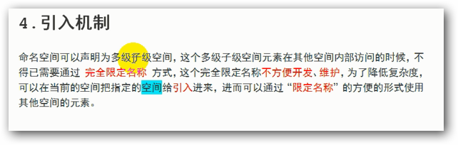

##命名空间

###访问命名空间的元素
	访问元素没有指明具体空间，默认访问当前空间（上边挨着最近的空间）

##多级命名空间

##空间元素访问的三种形式
	1.非限定名称：当前空间
	2.完全限定名称： 绝对空间
	3.限定名称：相对空间

##引入机制

### 空间引入use

### 元素引入(只能是类元素)
	*use 空间\元素

### 别名使用
	use 空间\元素 as 别名

###引入空间的影响

###公共空间

###命名空间使用注意

###7.tp框架中使用命名空间

